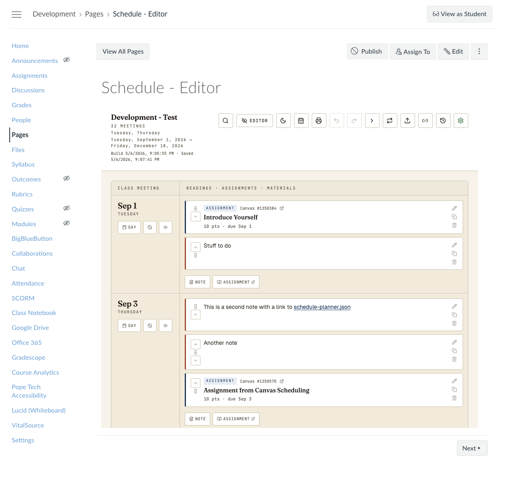
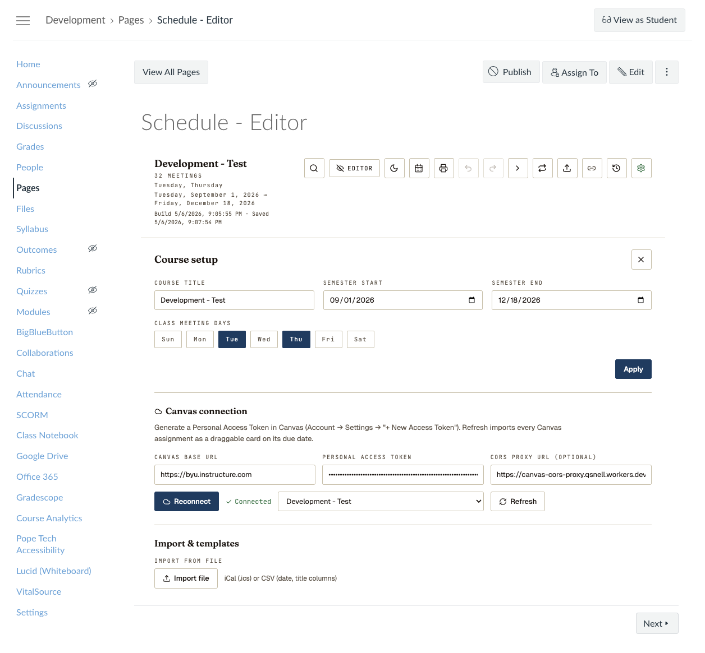
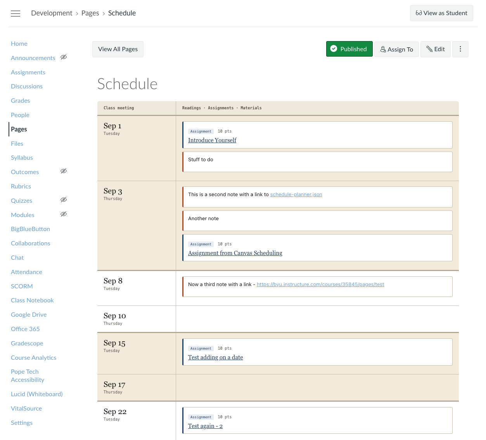
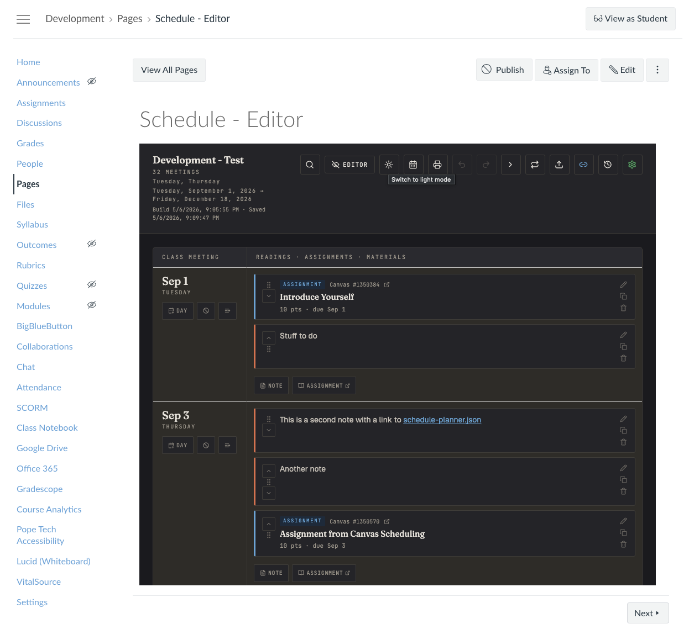

# Canvas Schedule Planner

A course-schedule planner for [Canvas LMS](https://www.instructure.com/canvas) that gives instructors a class-day-by-class-day grid for planning a semester. Drag assignments between days (syncs due dates to Canvas), add rich-text reading notes and material links on each meeting, and see weeks at a glance.

Canvas's native calendar and syllabus pages don't offer a row-per-class-meeting layout with draggable content — the kind of spreadsheet-style course planner that many instructors relied on in other LMS tools. This app fills that gap.



## Features

### Schedule grid
- Set semester start/end and which weekdays you teach — the grid auto-generates one row per class meeting
- Each row has a date column and a content column with draggable cards
- **Week banding**: alternating row shading, week separator lines, and "Week N" labels
- **Module headers**: group days into named units with automatic day counts

### Content management
- **Drag assignments** to a different day — Canvas due date updates automatically via API
- **Rich-text notes** with bold, italic, lists, links, and inline images
- **Duplicate** any card with one click
- **Reorder** items within a day via drag or arrow buttons
- **Recurring notes**: batch-create a note on every matching teaching day (e.g., "Weekly Quiz" on all Fridays)



### Canvas integration
- Import all assignments from a Canvas course with one click
- **"+ Assignment"** button opens Canvas's assignment editor; new assignment auto-appears on the correct day when you return
- Renames sync back to Canvas in real time
- **Publish** the schedule as a Canvas Page (responsive to dark/light mode)
- **Conflict detection**: warns if another instructor published changes since your last load
- **Assignment groups** imported from Canvas with color-coded pills

### Import & export
- **iCal export** (.ics) for subscribing in calendar apps
- **iCal/CSV import** to bring in events from other sources
- **Semester templates**: export a schedule mapped by teaching-day position (not absolute dates), then import into a new semester — items land on the correct week and day automatically

### Other

| Student view | Dark mode |
|---|---|
|  |  |

- **Undo/redo** (Ctrl/Cmd+Z, up to 30 levels)
- **Search and filter** by text or assignment group
- **Dark mode** with automatic OS preference detection
- **Print-optimized** layout
- **Student view** toggle (read-only, no editing controls)
- **Bulk date shift** (forward/backward, with holiday-aware option)
- **Holiday marking** with labels and diagonal-stripe visual
- Touch-friendly drag-and-drop via `@dnd-kit`
- Keyboard accessible with skip links and focus management

## Installation

See **[INSTALL.md](./INSTALL.md)** for full setup instructions, including how to use the hosted version, deploy your own instance, and set up a CORS proxy.

## Quick start

```bash
npm install
npm run dev
```

Open http://localhost:5173.

For development with Canvas API proxying (avoids CORS issues):

```bash
./dev.sh
```

## Setup

1. Click the **gear icon** (⚙) to open Course Setup
2. Set your course title, semester start/end dates, and teaching days
3. Enter your Canvas base URL (e.g., `https://youruniversity.instructure.com`) and a [Personal Access Token](https://community.canvaslms.com/t5/Admin-Guide/How-do-I-manage-API-access-tokens-as-an-admin/ta-p/89)
4. Pick your course from the dropdown and click **Refresh** to import assignments

## Deployment

```bash
npm run build
```

Upload `dist/` to any static host (GitHub Pages, Netlify, Vercel, your university web space). The `vite.config.js` uses `base: './'` so the build works from any path.

To embed in Canvas, create a Page and add:

```html
<iframe src="https://your-host/" width="100%" height="900" style="border:0"></iframe>
```

Your Canvas admin may need to whitelist the host domain for iframe embedding.

### CORS proxy

Canvas API blocks cross-origin browser requests. In production, requests route through a Cloudflare Worker CORS proxy included in `cors-proxy/`. Deploy it with [Wrangler](https://developers.cloudflare.com/workers/wrangler/):

```bash
cd cors-proxy
npx wrangler deploy
```

The proxy URL is configurable per-institution via the setup panel, `VITE_CORS_PROXY` env var, or localStorage. In dev mode, Vite's built-in proxy handles CORS automatically.

## Architecture

Single-page React app (Vite + React 18) with no backend. All state lives in `localStorage`. Canvas API calls go directly from the browser with a user-supplied Personal Access Token.

### Tech stack
- **React 18** with Vite
- **@dnd-kit** for drag-and-drop (pointer, touch, and keyboard)
- **Tailwind v4** (PostCSS build) for layout utilities
- **Inline styles** against a theme object for component styling
- **Vitest** for unit testing
- **GitHub Actions** for CI (build + test)

### File map

```
src/
├── main.jsx                # Entry point: ReactDOM + ErrorBoundary
├── App.jsx                 # Main component: all state, handlers, layout
├── theme.js                # Light/dark palettes, fonts, color constants
├── styles.js               # App CSS: responsive, print, accessibility
├── utils.js                # Date math, iCal/CSV parsing, templates, persistence
├── canvas-api.js           # Canvas REST client with pagination and CORS proxy
├── render-schedule-html.js # Static HTML generator for Canvas Page publish
├── __tests__/
│   └── utils.test.js       # Unit tests (68 tests)
└── components/
    ├── ui.jsx              # Shared primitives: buttons, fields, style helpers
    ├── Header.jsx          # App toolbar: title, search, action buttons
    ├── ScheduleTable.jsx   # Schedule grid with module headers and day rows
    ├── ClassDayRow.jsx     # Single schedule row: date column + content column
    ├── ItemCard.jsx        # Assignment/note card with RichEditor
    ├── UnscheduledZone.jsx # Sidebar drop target for unscheduled items
    ├── PublishBanner.jsx   # Publish success banner + activity log
    └── Panels.jsx          # SetupPanel, ShiftModal, ConflictModal, RecurringModal
```

| Module | Purpose |
|---|---|
| `App.jsx` | State orchestrator — owns schedule data, undo stack, Canvas sync, and top-level layout |
| `theme.js` | LIGHT/DARK color palettes, mutable `T` reference, typography constants |
| `styles.js` | CSS string injected via `<style>` — responsive breakpoints, print layout, accessibility |
| `utils.js` | Pure utilities: date arithmetic, day-of-week codes, iCal/CSV parsing, semester templates, `Store` persistence |
| `canvas-api.js` | Canvas REST API client with automatic pagination (Link headers), CORS proxy routing |
| `render-schedule-html.js` | Generates a static HTML table for publishing to Canvas Pages (dark mode responsive) |
| `Header.jsx` | Course title, meeting count, search bar, and toolbar (undo, publish, settings, etc.) |
| `ScheduleTable.jsx` | Renders the full schedule grid: column headers, module dividers, and `ClassDayRow` for each day |
| `ClassDayRow.jsx` | One row: date/week label on the left, droppable content area with item cards on the right |
| `ItemCard.jsx` | Assignment or rich-text card with drag handle, inline editing, and `RichEditor` |
| `Panels.jsx` | Setup panel (semester config + Canvas connection + import/templates), shift modal, conflict resolution, recurring notes |

### Data flow

```
User action → updateState() → structuredClone + undo snapshot → setState()
                                                                    ↓
                                                              auto-save to localStorage
                                                                    ↓
                                                              React re-render
```

Canvas sync happens as a side effect: moving an assignment calls `CanvasAPI.setDueDate()` after updating local state. Refreshing from Canvas merges remote assignments into local state.

## Caveats

- **Token storage**: Personal Access Token is stored in `localStorage`. Fine for single-instructor use on your own machine. Don't deploy this as a multi-tenant service — switch to OAuth2 or LTI 1.3 for that.
- **Rich editor**: Uses the deprecated `document.execCommand` API. Still works in all major browsers as of 2026. If it breaks, swap to [tiptap](https://tiptap.dev/) or [Lexical](https://lexical.dev/).
- **No real-time collaboration**: Each instructor works on their own local copy. The publish/conflict system handles sequential editing but not simultaneous.

## Contributing

See [CONTRIBUTING.md](./CONTRIBUTING.md) for setup instructions, coding conventions, and how to submit pull requests.

## License

MIT — see [LICENSE](./LICENSE) for details.
